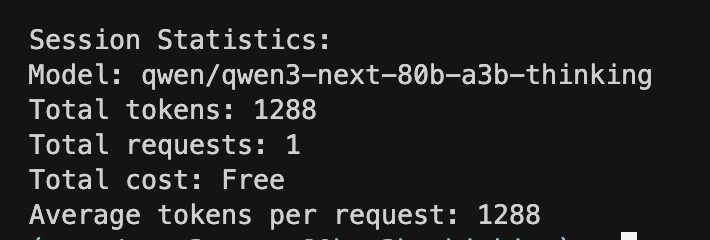
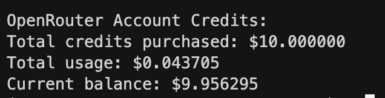
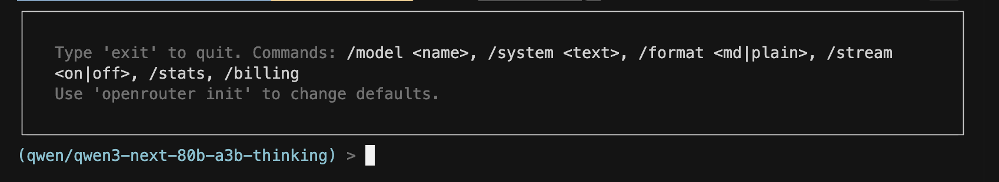

# openrouter-cli

[](https://www.npmjs.com/package/@letuscode/openrouter-cli)
[](https://www.npmjs.com/package/@letuscode/openrouter-cli?activeTab=versions)


## 📽️ Video Overview

Want to see OpenRouter CLI in action? Watch our [video overview](https://youtu.be/UhWFaFXR1Vs?si=O1nr95-VMvXEbXZ0)!

[](https://youtu.be/UhWFaFXR1Vs?si=O1nr95-VMvXEbXZ0)

OpenAI‑compatible CLI for `OpenRouter`. Ask questions, chat in a REPL, and fuzzy‑search models.

> **Note**: This project is in MVP development. Beta releases are for testing, and stable releases are for general use. See [Release Strategy](docs/RELEASE_STRATEGY.md) for details.

You can change your model any time. In a terminal, run `openrouter models` to browse, or in the REPL type `/model` to search inline. Tip: search for `free` to see free models.

<table>
<tr>
<td align="center">

<br><em>Monitor your current session costs</em>
</td>
<td align="center">

<br><em>Get Billing Information</em>
</td>
</tr>
</table>

## Fuzzy Search Models

<table>
<tr>
<td align="center">

<br><em>Monitor your current session costs</em>
</td>
</tr >
</table>

## Repl Chat Configurations

<table>
<tr>
<td align="center">

<br><em>Repl Chat Configurations</em>
</td>
</tr >
</table>

## Install

### Stable Release (Recommended)

- Global: `npm i -g @letuscode/openrouter-cli`
- One‑off: `npx @letuscode/openrouter-cli --help`

### Beta Release (Testing)

- Global: `npm i -g @letuscode/openrouter-cli@beta`
- One‑off: `npx @letuscode/openrouter-cli@beta --help`

Tip: Running `openrouter` with no args starts the setup wizard and then opens the REPL (in a terminal).

### Requirements

- Node.js 18.17+ (ESM)

## Quick start

1. Create an API key: https://openrouter.ai/keys
2. Run setup: `openrouter` (or `openrouter init`) — enter your key if asked, then pick a model
3. Ask once: `openrouter ask "Hello!"` — formatted answer by default
4. Chat: `openrouter repl` — formatted replies; toggle streaming when you like

## Everyday commands

- `openrouter` (or `openrouter init`) — setup; uses the OpenRouter domain automatically; asks for a key only if missing; lets you pick a model; opens the REPL afterwards
- `openrouter ask "…"` — answer a single question (formatted by default)
- `openrouter repl` — interactive chat
  - In the REPL:
    - `/model` → inline search; type a few letters, pick a match
    - `/model <id>` → set a specific model
    - `/format md|plain` → formatted or plain replies (non‑stream)
    - `/stream on|off` → stream tokens or wait for a full reply
    - `exit` → quit
- `openrouter models [query]` — browse models (fuzzy search) in a terminal; prints a table in non‑TTY
- `openrouter config --list` — show current settings (keys are masked)
- `openrouter config --api-key sk-…` — set your key once (or use the env var below)

## Behavior & defaults

- Ask: non‑stream + markdown rendering by default. Add `--stream` to stream tokens.
- REPL: streaming OFF by default; markdown rendering for full replies; inline `/model` search.

## Configuration

- API key via env (recommended): `export OPENROUTER_API_KEY=…` (or `OPENAI_API_KEY`)
- Global config file: `~/.config/openrouter-cli/config.json` (private; keys never logged)
- Project overrides: add `.openrouterrc` (JSON or YAML) in your project root
  - Example `.openrouterrc` (JSON):
    {
    "domain": "https://openrouter.ai/api/v1",
    "model": "openrouter/auto"
    }
- Domain: fixed to the OpenRouter domain today (no prompt); kept in config for future provider choices
- Change your default model any time by running `openrouter` again
- Precedence: project rc > profile > global; env keys override persisted keys

## Model search

- `openrouter models` opens an interactive search in a terminal (type 2–3 letters)
- `openrouter models llama` starts with “llama” suggestions; prints a table in non‑TTY

### Example: inline model search in REPL

```text
(openai/gpt-oss-20b:free) > /model
Search models (>=2 chars, blank to cancel): free
Matches:
1. openai/gpt-oss-120b:free — OpenAI: gpt-oss-120b (free)
2. openai/gpt-oss-20b:free — OpenAI: gpt-oss-20b (free)
…
Pick 1-10 or type a model id:
```

## Output & accessibility

- Non‑stream answers render markdown (bold/italic, headings, lists, inline code). Streaming prints raw tokens for responsiveness.
- A “Thinking” spinner shows while waiting; colors/spinners honor `NO_COLOR` and TTY detection.

## Troubleshooting

- Missing API key: set `OPENROUTER_API_KEY` or run `openrouter` again. View current config: `openrouter config --list`.
- “Policy / free endpoints” error: open https://openrouter.ai/settings/privacy and enable free endpoints, or choose a different model (`openrouter models`).
- Picker shows a table: run in a terminal (TTY). Check: `node -p "process.stdout.isTTY && process.stdin.isTTY"`.
- Friendly errors are shown; details are logged to `~/.config/openrouter-cli/cli.log`.

## Advanced flags (optional)

- Ask: `--stream`, `--format auto|plain|md`, `-s, --system <text>`, `--profile <name>`, `--no-init`
- Models: `--non-interactive`
- Config (debug): `--danger-reset`, `--override-json '<json>'`

## License

- Polyform Noncommercial License 1.0.0
